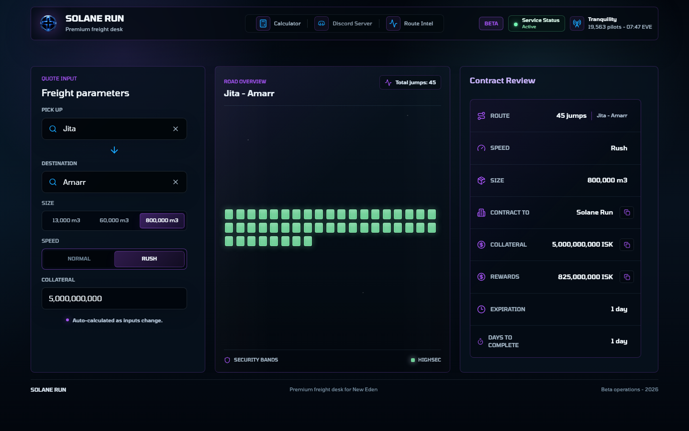
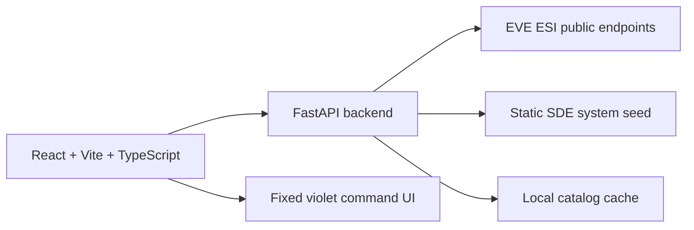

# Solane Run

<p align="center">
  
</p>

<p align="center">
  <strong>Premium freight calculator for EVE Online logistics.</strong><br />
  Public ESI only, route reconnaissance, and a modern command-desk interface for Solane Run.
</p>

<p align="center">
  <a href="https://github.com/VicoD3X/solane-run/actions/workflows/ci.yml">
    
  </a>
  
  
  
  
</p>



## Mission

Solane Run is the foundation for a premium freight service around EVE Online logistics. The beta surface focuses on a fast, readable freight calculator: select a pick up system, select a destination, choose a cargo size, and get an automatically refreshed route-backed quote.

The product intentionally avoids EVE SSO, private structures, contracts, saved quotes, accounts, and authenticated ESI scopes during this phase. The app is built to stay useful with public data for as long as possible.

## Current Surface

| Area | Status | Notes |
| --- | --- | --- |
| Freight calculator | Active | Pick Up, Destination, cargo size, free collateral up to 5B ISK, contract review |
| System catalog | Active | Official SDE seed filtered to HighSec, LowSec, Pochven, Thera, and Zarzakh |
| Road overview | Active | Public ESI route, gate-to-gate jumps, system security bar, and last-hour traffic tooltips |
| Tranquility status | Active | Public ESI status with player count and EVE time |
| Private ESI features | Out of scope | No auth, no saved quotes, no private structures, no contracts |

## Architecture



### Monorepo layout

```text
apps/
  web/       React, Vite, TypeScript, Tailwind, local fonts
  api/       FastAPI, Pydantic, async httpx ESI client
docs/
  design/    Accepted visual concept
  github/    Repository presentation assets
infra/       Docker Compose and nginx scaffolding
logo/        Source Solane Run brand assets
scripts/     Local verification scripts
```

## Public Data Policy

Solane Run currently uses public data only:

- ESI route endpoint for gate-to-gate routes
- ESI system jumps endpoint for last-hour traffic context
- ESI status endpoint for Tranquility status
- ESI systems refresh for catalog validation
- Official SDE seed for the selectable system catalog

Excluded on purpose:

- EVE SSO and OAuth
- private citadel or structure reads
- saved quotes tied to user accounts
- private contracts or corporation order data
- admin pricing panels

## Visual System

The global UI accent is fixed to Solane Run violet for consistency across the calculator. Route and system-specific security information still uses service colors where it carries operational meaning.

| Service | Color |
| --- | --- |
| Pochven | `#6E1A37` |
| Thera | `#56B6C6` |
| HighSec | `#6FCF97` |
| LowSec | `#F45B26` |
| Zarzakh | `#839705` |

## Local Development

Install frontend dependencies:

```powershell
npm install
```

Install backend dependencies:

```powershell
py -m pip install -r apps/api/requirements-dev.txt
```

Run the API:

```powershell
npm run dev:api
```

Run the web app:

```powershell
npm run dev:web
```

Open the app at:

```text
http://127.0.0.1:5173/
```

## Verification

```powershell
npm run lint:web
npm run build:web
npm run test:api
node scripts/verify-ui.mjs
docker compose -f infra/docker-compose.yml config
```

`scripts/verify-ui.mjs` is the current Playwright smoke test. It validates the main calculator flow, fixed violet UI accent, automatic route refresh, road overview behavior, responsive rendering, and the absence of private/auth-oriented UI.

## Environment

Copy `.env.example` and configure values as needed:

```text
VITE_API_BASE_URL=http://localhost:8000
ESI_BASE_URL=https://esi.evetech.net/latest
ESI_DATASOURCE=tranquility
ESI_COMPATIBILITY_DATE=
ESI_USER_AGENT=Solane Run beta contact@example.com
CORS_ORIGINS=http://localhost:5173
```

## Deployment Direction

The repository is prepared for a future Hetzner VPS deployment through Docker. Domain, TLS, runtime secrets, and VPS-specific hardening are intentionally left for the deployment phase.

## Roadmap

- Stabilize freight pricing formulas
- Expand calculator rules around service classes
- Promote Playwright smoke checks into a full E2E suite
- Add production Docker profiles for Hetzner
- Keep the app English-only and public-ESI-first

## Disclaimer

Solane Run is an independent EVE Online logistics tool. It is not affiliated with or endorsed by CCP Games.
