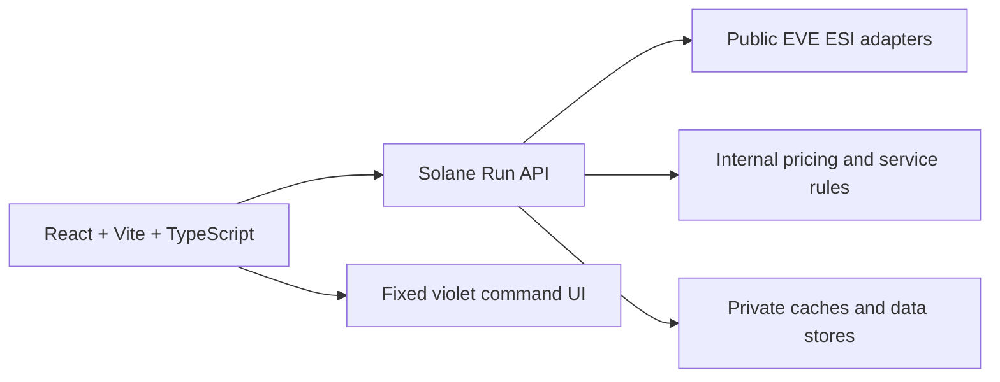

# Solane Run

<p align="center">
  
</p>

<p align="center">
  <strong>Premium freight calculator for EVE Online logistics.</strong><br />
  Public source-available frontend for route reconnaissance and a modern command-desk interface for Solane Run.
</p>

<p align="center">
  <a href="https://github.com/VicoD3X/solane-run/actions/workflows/ci.yml">
    
  </a>
  
  
  
  
  
</p>


## Mission

Solane Run is the frontend foundation for a premium freight service around EVE Online logistics. The beta surface focuses on a fast, readable freight calculator: select a pick up system, select a destination, choose a cargo size, and get an automatically refreshed route-backed contract review.

The public repository intentionally contains only the web app and is distributed under a proprietary All Rights Reserved license. The web app consumes a Solane Run API for public EVE data, route intelligence, and server-owned pricing.

## Current Surface

| Area | Status | Notes |
| --- | --- | --- |
| Freight calculator | Active | Pick Up, Destination, cargo size, free collateral up to 5B ISK, contract review |
| System catalog | API-backed | Provided by the Solane Run API |
| Road overview | API-backed | Gate-to-gate route, system security bar, route risk, and last-hour traffic tooltips |
| Tranquility status | API-backed | Player count and EVE time exposed through the Solane Run API |
| Backend logic | Server-owned | Public ESI adapters, pricing rules, caches, and internal operations are not published here |

## Architecture



### Repository layout

```text
apps/
  web/       React, Vite, TypeScript, Tailwind, local fonts
docs/
  api/       Frontend-facing API contract
  design/    Accepted visual concept
  github/    Repository presentation assets
infra/       Frontend Docker Compose and nginx scaffolding
logo/        Source Solane Run brand assets
scripts/     Local verification scripts
```

## API Boundary

This repository does not ship backend source code. The web app talks to a Solane Run API through `VITE_API_BASE_URL`.

The Solane Run API is responsible for:

- public EVE ESI adapters and compatibility handling
- SDE/system catalog filtering
- route policy, route traffic, route risk, and cache strategy
- Solane Run pricing formulas and service rules
- future account and order workflows, if they return later

The frontend-facing contract is documented in [`docs/api/frontend-contract.md`](docs/api/frontend-contract.md). Public contributors should treat that document as the integration surface and should not add backend business logic to this repository.

Out of scope for the public repo:

- EVE SSO and OAuth
- private ESI scopes or structure reads
- Solane Run pricing formulas
- saved quotes tied to accounts
- private contracts, corporation order data, or admin panels

## Visual System

The global UI accent is fixed to Solane Run violet for consistency across the calculator. Route and system-specific security information still uses service colors where it carries operational meaning.

| Service | Color |
| --- | --- |
| Pochven | `#6E1A37` |
| Thera | `#56B6C6` |
| HighSec | `#6FCF97` |
| LowSec | `#F45B26` |
| Zarzakh | `#839705` |

## Local Development

Install frontend dependencies:

```powershell
npm install
```

For the full local workspace with frontend + private API, use the local cockpit:

```powershell
npm run local:start
npm run local:status
npm run local:doctor
npm run local:stop
```

This starts the sibling `solane-api` service, starts Vite, and automatically points
the frontend to the actual local API port. If Windows keeps a stale socket on
`8001`, the cockpit moves the API to `8002+` for that session.

The detailed process is documented in [`docs/local-workspace.md`](docs/local-workspace.md).

Frontend-only development remains available:

```powershell
npm run dev:web
```

Open the app at:

```text
http://127.0.0.1:5173/
```

## Docker Preview

The frontend container can proxy `/api/*` to a Solane Run API container when both services join the same Docker network:

```powershell
docker network create solane-run
docker compose -f infra/docker-compose.yml up -d --build
```

If the default port is already in use, override it:

```powershell
$env:WEB_PORT="8080"
docker compose -f infra/docker-compose.yml up -d --build
```

Hetzner deployment notes live in [`docs/deploy/hetzner-vps.md`](docs/deploy/hetzner-vps.md).

## Verification

```powershell
npm run lint:web
npm run build:web
npm run security:web
node scripts/verify-ui.mjs
npm run w3c:web
docker compose -f infra/docker-compose.yml config
```

`npm run w3c:web` validates the rendered React page with local HTML5 checks and WAI/WCAG accessibility rules. It intentionally does not run a legacy CSS validator because the UI uses modern CSS features required by the design system.

`npm run security:web` validates the first frontend hardening layer: CSP/header coverage, no browser-side dangerous rendering APIs, no production sourcemaps, and no private EVE token patterns in public frontend files.

`scripts/verify-ui.mjs` is the current Playwright smoke test. It always validates the frontend shell and responsive rendering. When `VITE_API_BASE_URL` is set and points to a compatible Solane Run API, it also validates automatic route refresh and road overview behavior.

## Environment

Copy `.env.example` and configure values as needed:

```text
VITE_API_BASE_URL=http://localhost:8001
```

## License

Copyright 2026 Victor A. All rights reserved.

This repository is public for visibility and review, but it is not open source under a permissive license. Copying, redistribution, hosting, modification, or commercial use requires prior written permission.

## Disclaimer

Solane Run is an independent EVE Online logistics tool. It is not affiliated with or endorsed by CCP Games.
