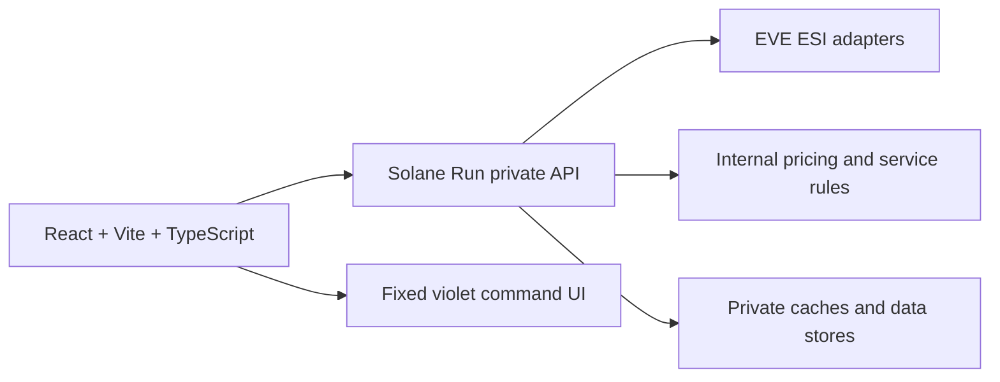

# Solane Run

<p align="center">
  
</p>

<p align="center">
  <strong>Premium freight calculator for EVE Online logistics.</strong><br />
  Public source-available frontend for route reconnaissance and a modern command-desk interface for Solane Run.
</p>

<p align="center">
  <a href="https://github.com/VicoD3X/solane-run/actions/workflows/ci.yml">
    
  </a>
  
  
  
  
  
</p>


## Mission

Solane Run is the frontend foundation for a premium freight service around EVE Online logistics. The beta surface focuses on a fast, readable freight calculator: select a pick up system, select a destination, choose a cargo size, and get an automatically refreshed route-backed contract review.

The public repository intentionally contains only the web app and is distributed under a proprietary All Rights Reserved license. EVE ESI integration, future pricing rules, operational logic, contract automation, account flows, and internal Solane Run services live behind a private API.

## Current Surface

| Area | Status | Notes |
| --- | --- | --- |
| Freight calculator | Active | Pick Up, Destination, cargo size, free collateral up to 5B ISK, contract review |
| System catalog | API-backed | Provided by the private Solane Run API |
| Road overview | API-backed | Gate-to-gate route, system security bar, and last-hour traffic tooltips |
| Tranquility status | API-backed | Player count and EVE time exposed through the private API |
| Backend logic | Private | EVE ESI adapters, pricing rules, caches, and internal operations are not published here |

## Architecture



### Repository layout

```text
apps/
  web/       React, Vite, TypeScript, Tailwind, local fonts
docs/
  api/       Frontend-facing private API contract
  design/    Accepted visual concept
  github/    Repository presentation assets
infra/       Frontend Docker Compose and nginx scaffolding
logo/        Source Solane Run brand assets
scripts/     Local verification scripts
```

## API Boundary

This repository does not ship backend source code. The web app talks to a Solane Run API through `VITE_API_BASE_URL`.

The private API is responsible for:

- EVE ESI adapters and compatibility handling
- SDE/system catalog filtering
- route policy, route traffic, and cache strategy
- Solane Run pricing formulas and service rules
- future account, order, and internal operational workflows

The frontend-facing contract is documented in [`docs/api/frontend-contract.md`](docs/api/frontend-contract.md). Public contributors should treat that document as the integration surface and should not add backend business logic to this repository.

Out of scope for the public repo:

- EVE SSO and OAuth
- private ESI scopes or structure reads
- Solane Run pricing formulas
- saved quotes tied to accounts
- private contracts, corporation order data, or admin panels

## Visual System

The global UI accent is fixed to Solane Run violet for consistency across the calculator. Route and system-specific security information still uses service colors where it carries operational meaning.

| Service | Color |
| --- | --- |
| Pochven | `#6E1A37` |
| Thera | `#56B6C6` |
| HighSec | `#6FCF97` |
| LowSec | `#F45B26` |
| Zarzakh | `#839705` |

## Local Development

Install frontend dependencies:

```powershell
npm install
```

Configure the private API base URL if needed:

```powershell
$env:VITE_API_BASE_URL="http://localhost:8001"
```

Run the web app:

```powershell
npm run dev:web
```

Open the app at:

```text
http://127.0.0.1:5173/
```

## Verification

```powershell
npm run lint:web
npm run build:web
node scripts/verify-ui.mjs
docker compose -f infra/docker-compose.yml config
```

`scripts/verify-ui.mjs` is the current Playwright smoke test. It always validates the frontend shell and responsive rendering. When `VITE_API_BASE_URL` is set and points to a compatible Solane Run API, it also validates automatic route refresh and road overview behavior.

## Environment

Copy `.env.example` and configure values as needed:

```text
VITE_API_BASE_URL=http://localhost:8001
```

## License

Copyright 2026 Victor A. All rights reserved.

This repository is public for visibility and review, but it is not open source under a permissive license. Copying, redistribution, hosting, modification, or commercial use requires prior written permission.

## Deployment Direction

The public repository builds the frontend container only. Production deployment will pair this web app with the private Solane Run API on the Hetzner VPS. Domain, TLS, runtime secrets, API deployment, and VPS-specific hardening are intentionally left for the private deployment phase.

## Roadmap

- Stabilize freight pricing formulas
- Expand calculator rules around service classes through the private API
- Promote Playwright smoke checks into a full E2E suite
- Add production frontend Docker profiles for Hetzner
- Keep the app English-only and API-contract-first

## Disclaimer

Solane Run is an independent EVE Online logistics tool. It is not affiliated with or endorsed by CCP Games.
